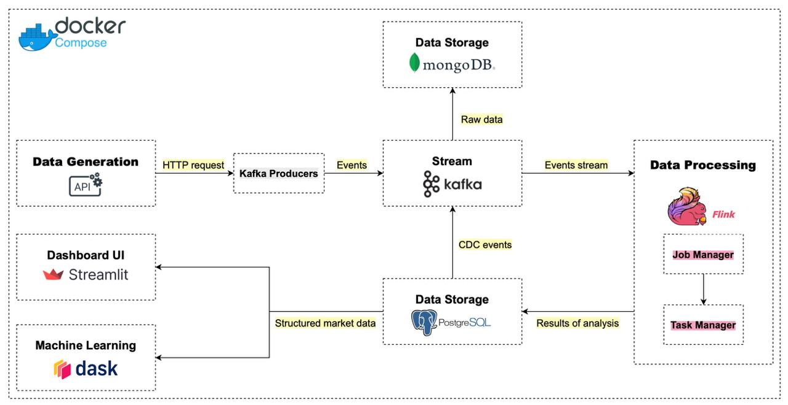
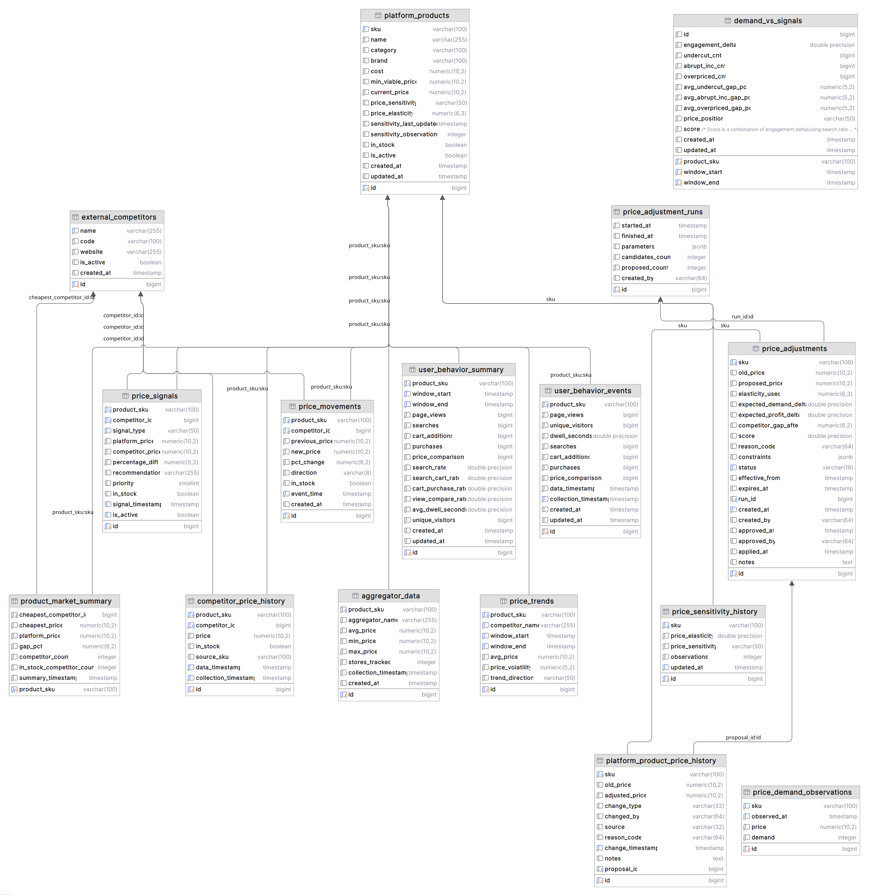

## Price Intelligence Platform

End‑to‑end pricing system: collects competitor data, detects signals, estimates elasticity, proposes price changes, and applies approved changes with an auditable history.

### Architecture



### Data Model



### Requirements

- Docker
- Docker Compose
- Bash shell

### Components

- Kafka + Producers (`kafka/`): Ingest competitor prices and synthetic user behavior.
- Flink Jobs (`flink/jobs/`):
  - `alerts_job.py`: actionable price signals (undercut, overpriced, abrupt increase).
  - `price_monitoring_job.py`, `dims_job.py`, `summary_job.py`, `alerts_job.py`.
  - `price_movements` sink for high‑frequency raw movements.
- PostgreSQL (`postgres/init.sql`): core tables:
  - `platform_products`, `platform_product_price_history` (with `proposal_id`).
  - `competitor_price_history`, `price_movements`, `price_signals`.
  - `user_behavior_summary`, `demand_vs_signals`.
  - `price_adjustment_runs`, `price_adjustments`.
- ML Services (`ml_services/`):
  - `price_elasticity/price_sensitivity_updater.py`: estimates elasticity and sensitivity labels.
  - `price_adjustment/price_adjustment.py`: proposer (Dask) generating `price_adjustments`.
  - `price_adjustment/apply_proposals.py`: applier updating platform price and history.
- Dashboard (`dashboard/`): Streamlit app with pages for Home, Price Trends, Signals, Demand vs Signals, Elasticity, and Price Adjustments.

### Key Flows

1) Ingest → Kafka → Flink → Postgres:
   - Competitor prices → `competitor_price_history` (+ 5‑min windows in charts).
   - Signals → `price_signals`. Raw telemetry → `price_movements`.
2) Elasticity:
   - Aggregates recent demand (`user_behavior_summary`), updates `platform_products.price_elasticity` and `price_sensitivity_history`.
3) Price Adjustment:
   - Proposer computes proposals per SKU using elasticity; optionally anchors to forecasted cheapest competitor (confidence‑gated). Writes to `price_adjustments` and logs `price_adjustment_runs`.
   - Applier applies approved (or pending if auto) proposals atomically and records `platform_product_price_history` with `proposal_id`.

### Quick Start

```bash
bash run.sh start
```

- Logs: `bash run.sh logs`
- Stop and remove containers/volumes: `bash run.sh stop`
- Rebuild images: `bash run.sh build && bash run.sh start`

After services are up, submit the Flink jobs:

```bash
bash run_flink_jobs.sh
```

Optional: check job status in the Flink UI (http://localhost:8081) or via CLI:

```bash
docker exec flink-jobmanager /opt/flink/bin/flink list | cat
```

### URLs (defaults)

- Dashboard (Streamlit): `http://localhost:8501`
- Kafka UI: `http://localhost:8080`
- Adminer (Postgres UI): `http://localhost:8050`
- Flink UI: `http://localhost:8081`
- Data API: `http://localhost:8000/docs`


### License

This project is licensed under the MIT License. See the [LICENSE](LICENSE) file for details.

